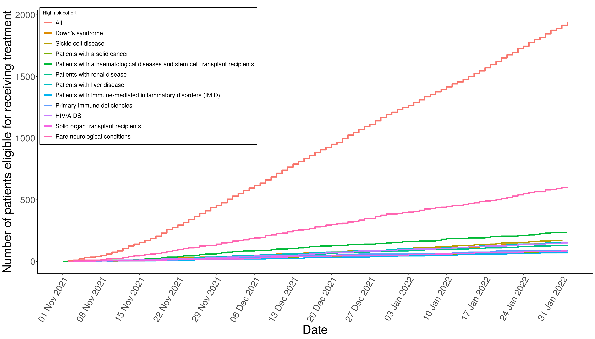
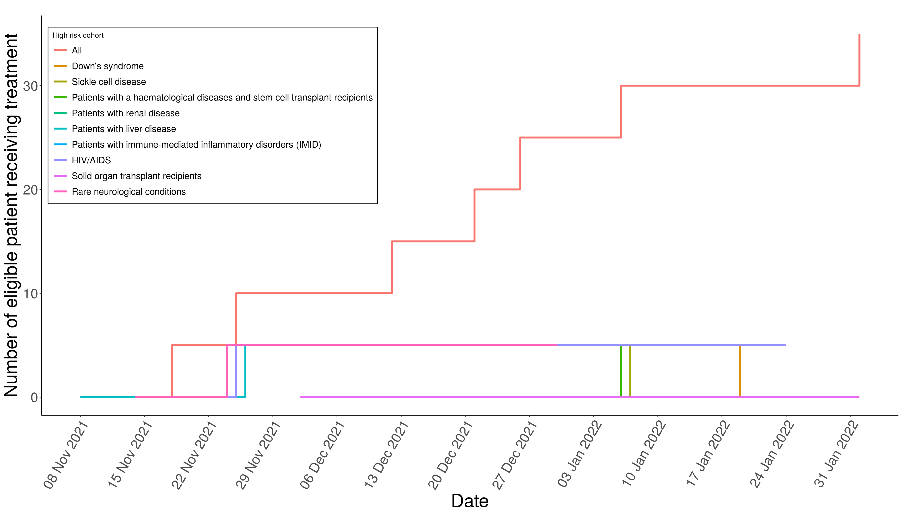

  
```{css, echo=FALSE}
pre {
  max-height: 300px;
  overflow-y: auto;
}
pre[class] {
  max-height: 200px;
}
```

<style>
  body {
    text-align: justify;
     font-size: 11pt}
</style>

  
$$\\[0.25cm]$$
```{r setup, include=FALSE}
# Document settings ----
knitr::opts_chunk$set(echo = TRUE)

# Import libraries ----
library(tidyverse)
library(here)
library(kableExtra)
library(knitr)
library(ggplot2)
library(png)
library(readr)
library(htmltools)

# Import data ----
report_stats <- read_csv(here::here("reports", "coverage", "tables", "report_stats.csv"))
table_elig_treat_redacted <- read_csv(here::here("reports", "coverage", "tables", "table_elig_treat_redacted.csv"))
```

# Overview
While vaccines remain the best strategy to prevent COVID-19, recent evidence suggests monoclonal antibodies (nMABs) or antivirals could potentially benefit certain vulnerable populations before or after exposure to SARS-CoV-2, such as the unvaccinated or recently vaccinated high-risk patients. 

With the recent roll out of nMABs and antivirals, there is an urgent need to for knowledge and understanding around the use of nMABs and antivirals in the treatment of patients with COVID-19, such as factors of relevance in determining nMAB and antiviral treatment and the impact of nMAB and antiviral treatment in the community and hospital settings.

This OpenSAFELY report ...

The code and data for this report can be found at the OpenSafely [antibody-and-antiviral-deployment repository](https://github.com/opensafely/antibody-and-antiviral-deployment).


##### Contents
* [Introduction](#intro)
* [Methods](#methods)
* [Results](#results)
  + [Coverage of COVID-19 treatment](#coverage)
  + [Delivery of nMAB and antiviral treatment](#delivery)
  + [Key demographic and clinical characteristics of treated patients](#demographic)
  + [Concordance with guidance](#concordance)
  + [Assessment of high risk patient cohorting](#cohorting)
  + [Time to treatment](#time)
  + [COVID-19-related events](#events)


      
# Introduction <a name="intro"></a>
    
    
      
# Methods <a name="methods"></a>
      
      
# Results <a name="results"></a>
      
## Coverage of COVID-19 treatment <a name="coverage"></a>
Between `r format(report_stats$study_start, format = "%d-%b-%Y")` and `r format(report_stats$study_end, format = "%d-%b-%Y")`, `r format(report_stats$eligible_patients, format = "%d-%b-%Y")` patients registered at a TPP practice in England were eligible for receiving a nMABs or antiviral for treating COVID-19 (Figure 1). Of these patients, a total of `r format(report_stats$treated_patients, format = "%d-%b-%Y")` patients had received treatment for COVID-19 within the same time period (Figure 2); `r format(report_stats$sotrovimab, format = "%d-%b-%Y")` received sotrovimab and `r format(report_stats$molnupiravir, format = "%d-%b-%Y")` received molnupiravir. 

$$\\[0.5cm]$$
```{r, coverage plot, echo=FALSE, message=FALSE, warning=FALSE, results='asis', fig.width=10, out.width = '80%', fig.align = 'center', fig.cap = "Figure 1: Cumulative total of patients eligible for receiving a nMABs or antiviral for treating COVID-19 since 20th December 2021, stratified by high risk cohort."}

```
$$\\[0.5cm]$$
```{r, treatment plot, echo=FALSE, message=FALSE, warning=FALSE, results='asis', fig.width=10, out.width = '80%', fig.align = 'center', fig.cap = "Figure 2: Cumulative total of eligible patients who received a nMABs or antiviral for treating COVID-19 since 20th December 2021, stratified by high risk cohort."}

```

## Delivery of nMAB and antiviral treatment <a name="delivery"></a>
The number of eligible patients receiving treatment varied by high risk group (Table 1). 

```{r, treatment breakdown, echo=FALSE, message=FALSE, warning=FALSE, out.width = '80%'}
table_elig_treat_redacted %>%
  kable(caption = "Table 1: Proportion of eligible patients receiving treatment for COVID-19, broken down by the high risk cohort", 
        row.names = FALSE, 
        align = c("l", rep("c", 4)),
        booktabs=TRUE, 
        table.attr = "style='width:30%;'") %>%
  kable_styling(position = "center", full_width = F)
```

## Key demographic and clinical characteristics of treated patients <a name="demographic"></a>
The proportion of eligible patients who had received treatment by `r format(report_stats$study_end, format = "%d-%b-%Y")`, broken down by demographic and clinical categories, is presented in Table 2. 

```{r, echo=FALSE}
htmltools::includeHTML("tables/table_demo_clinc_breakdown_redacted.html")
```


## Concordance with guidance <a name="concordance"></a>

## Assessment of high risk patient cohorting <a name="cohorting"></a>

## Time to treatment <a name="time"></a>

## COVID-19-related events <a name="events"></a>

      
